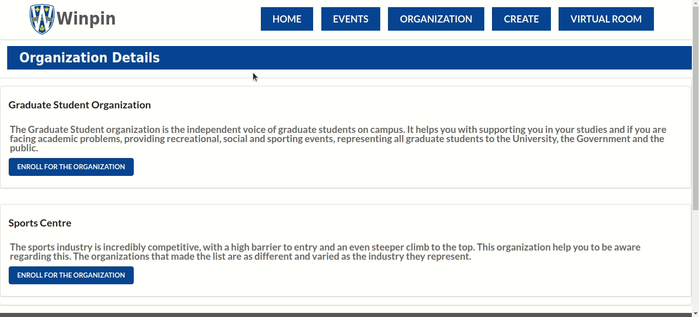
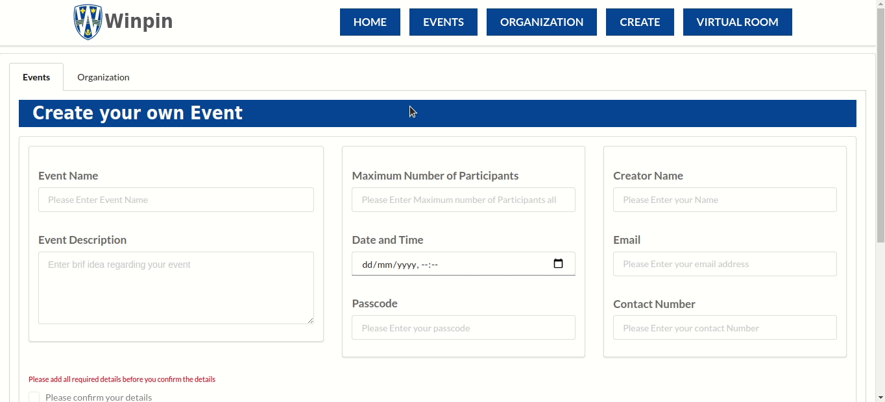
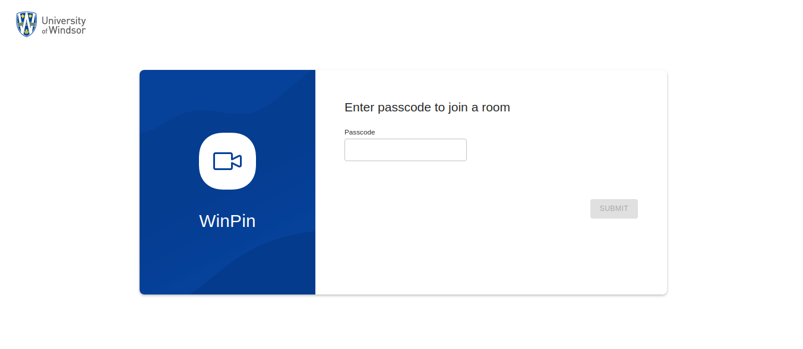
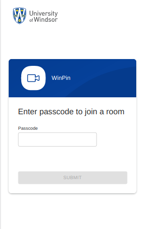
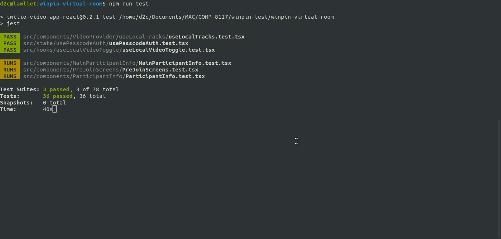
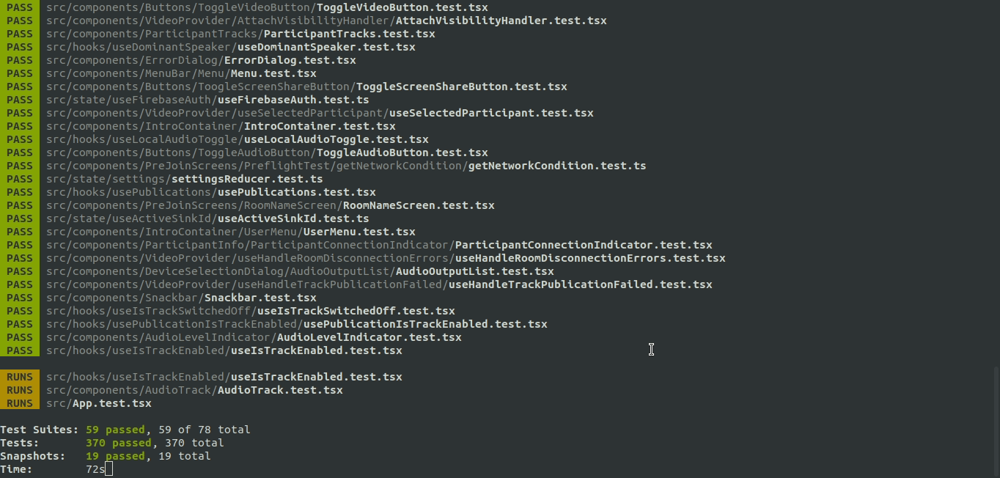
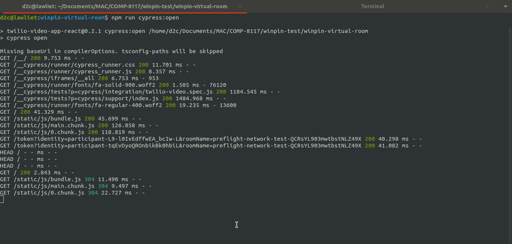
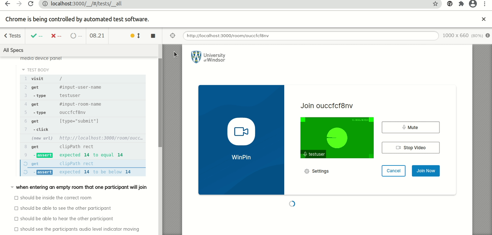

# Welcome to Winpin

An online UWindsor events platform where you can participate in events as well as create engaging virtual events. 

## Vision
The goal of this project is to design an Event Management portal “Winpin”, that allows users to participate in events and create engaging virtual events. The event portal will allow users to keep track of the different events, the schedule, the organizers and the overview of the events. The Organizers should be able to login to the system as an administrator to add and modify the events and view/edit participant list.

## Technical Details:
### Prerequisites
 - Node.js v12+
 - NPM v6+
 
### Install Dependencies
 - Run `npm install` to install all dependencies from NPM.
 - You can also use `yarn`
 
### Running the App locally
 - Run developer mode
   - Client:
      - `npm run dev`
   - Server:
      - `cd winpin-server`
      - `npm start`
   
### Building

Build the React app with
- npm run build

This script will build the static assets for the application in the `build/` directory.

### Tests

This application has unit tests (using [Jest](https://jestjs.io/)) and E2E tests (using [Cypress](https://www.cypress.io/)). 
You can run the tests with the following scripts.

Run unit tests with
- `npm tes`
- `npm run cypress:open`

### Deployment

Deployment of the React app to IBM Cloud
- `npm run build`
- `rm -r winpin-server/winpin-ui/`
- `cp -r build/ winpin-server/winpin-ui/`
- `cd winpin-server/`
- `ibmcloud cf push winpin`

To deploy app on IBM's Cloud Foundry you need to configure `ibmcloud` locally first!

## System Architecture
### ER Diagram
 

## Doc Resources
Following are the documents related to Winpin project.

## Inception Report
The Inception Report is to establish some initial common vision for the objectives of the project, determine if it is feasible, and decide on creation of elaboration phase.

For more details go to [Inception Report](./Inception%20Report.pdf)

## Elaboration Report - Phase 1
The Elaboration Phase-1 Report lists the Objective, Key requirements, Tasks that are identified and need to be performed, Task report and the Test cases that need to be executed once the requirements are implemented.

For more details go to [Elaboration Report - Phase 1](./Elaboration%20Report%20-%20Phase%201.pdf)

## Task List

## User Interface Design

#### Wireframe: 
[UI design](./Page%20UI.pptx)

#### Events: 
 

#### Organization: 
 

#### Create Events/Organizations: 
 

#### Virtual Room:
 
<!-- -->

## Test Cases
#### Unit Testing using Jest: 
 

 

#### E2E Testing using Cypress: 
 

 

