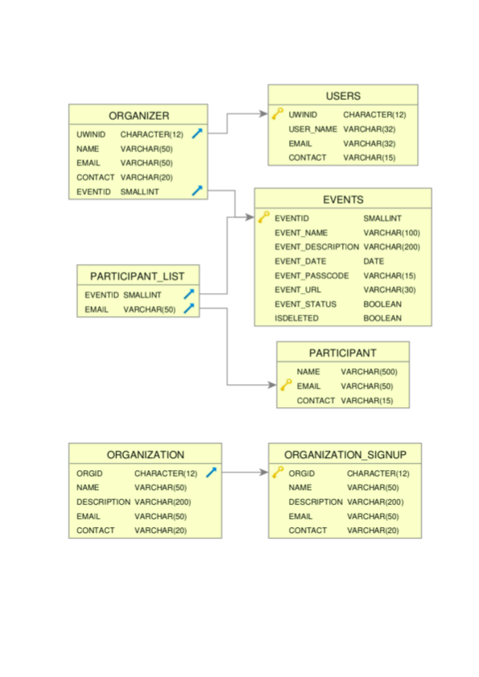

# Welcome to Winpin

An online UWindsor events platform where you can participate in events as well as create engaging virtual events. 

## Vision
The goal of this project is to design an Event Management portal “Winpin”, that allows users to participate in events and create engaging virtual events. The event portal will allow users to keep track of the different events, the schedule, the organizers and the overview of the events. The Organizers should be able to login to the system as an administrator to add and modify the events and view/edit participant list.

## Doc Resources

Following are the documents related to Winpin project.

## Inception Report
The Inception Report is to establish some initial common vision for the objectives of the project, determine if it is feasible, and decide on creation of elaboration phase.

For more details go to [Inception Report](./Inception%20Report.pdf)

## User Interface Design

#### Wireframe: 
[UI design](./Page%20UI.pptx)

#### Virtual Room:
 

## Task List

## Test Cases
## ER Diagram
 

